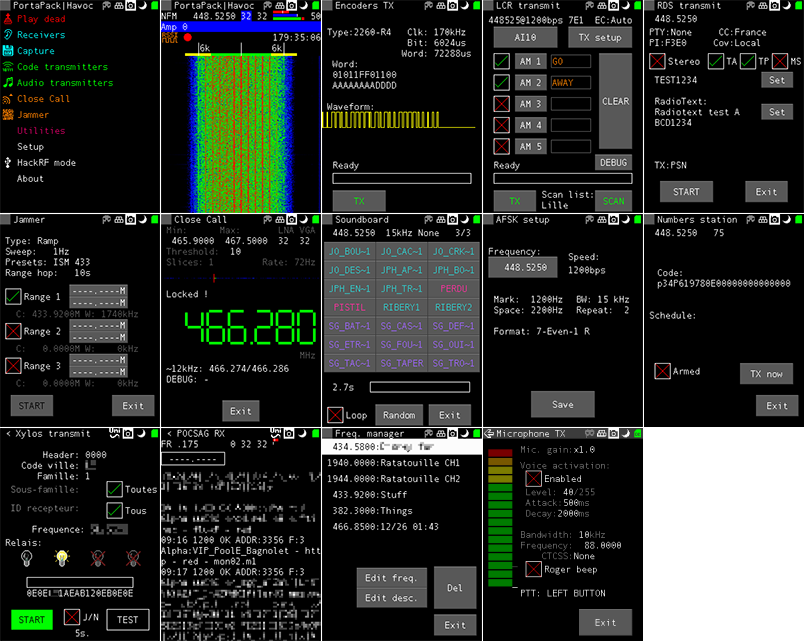

# portapack-HAVOC

HAVOC is a fork of the PortaPack H1 firmware, a portability add-on for the [HackRF One software-defined radio](http://greatscottgadgets.com/hackrf/).

Hardware is available at [ShareBrained Technology](http://sharebrained.com/portapack).

It is build on top of [ShareBrained's firmware](https://github.com/sharebrained/portapack-hackrf/), meaning that the original functionalities are kept (except when I don't sync for 2 months).

# Documentation

[READ THE WIKI](https://github.com/furrtek/portapack-havoc/wiki/Home/)

# Summary

As its name implies, HAVOC's functionalities can be fun (or mean). You shouldn't use them. No. Bad. Put it down.

**In most countries, radio transmissions are tightly regulated. Transmitting outside of free/public bands without a licence or authorization, even at very low power, is certainly forbidden where you live. Always bear that in mind. You're the ONLY ONE responsible for what you do with this software.**

# Fork features

* Microphone transmit with CTCSS
* Frequency manager (save & load from SD card)
* "Soundboard" wave file player (put 8-bit mono files in SD card /wav directory)
* POCSAG 512/1200/2400 transmitter
* POCSAG 512/1200/2400 receiver/decoder
* Morse transmitter (FM tone and CW)
* OOK transmitter for common remote encoders (PT2262, doorbells, remote outlets, some garage doors, ...)
* RDS (Radio Data System) PSN, RadioText and Time groups transmitter
* Fully configurable jammer
* Scheduled numbers station (for spies on a budget, alerts, LARP scenarios, ...)
* Nuoptix DTMF sync transmitter (quite specific but can be useful in some theme parks :) )
* AFSK transmitter (Bell202...)
* Virtual keyboard or Unistroke "handwriting" text input
* LCR (Language de Commande Routier) message generator
* "Xy" and "EP" transmitter, street lighting control (CCIR tones)
* "Play Dead" in case of emergency
* PWM audio RSSI output (for crude direction finding)

# Progress

Feature | Progress | Notes
------- | ------ | -----
POCSAG RX   | 95% | Needs support for numeric messages
Morse TX    | 95% | Symbols need testing
Mic. TX     | 95% | Need to find guard tones for various brands of wireless mics
RDS TX      | 90% | Radiotext isn't quite right yet
Close-Call™ | 85% | Needs adjustments and optimization for wider frequency range
SSTV TX     | 80% | Needs better bitmap file handling + testing
EPAR TX     | 60% | Older Xy, low priority
Sigfox RX   | 40% | Left aside, needs updates and testing
ADS-B TX    | 40% | UI and frame gen stuff done
Wave visualizer | 30% | High priority
IQ replay   | 30% | High priority
Whistle     | 20% | Easy
Generic TXs | 5%  | Raw AX.25, AFSK, FSK, CCIR, DTMF...
SI4032 TRX  | 0%  | And other sub-GHz transceiver chips
SSTV RX     | 0%  |
ADS-B RX    | 0%  | Could be fun
Scanner     | 0%  | Easy
SSB TX      | 0%  | Requested but math is hard :(
OOK RX      | 0%  | Mainly for 433MHz remotes
AFSK RX     | 0%  | Shouldn't be too tough
Analog TV TX| 0%  | Enough CPU ?

# Screenshots

# Thanks

* Sig and cLx for research on AFSK LCR, Xylos, and for lending remote-controlled outlets
* Rainer Matla and DC1RDB for the donations :)
* Keld Norman and Giorgio Campiotti for ideas and suggestions

# License

Except where specified in subdirectories of this project, all work is offered under the following license:

Copyright (C) 2013-2015 Jared Boone, ShareBrained Technology, Inc.

Copyright (C) 2015-2016 Furrtek

This program is free software; you can redistribute it and/or
modify it under the terms of the GNU General Public License
as published by the Free Software Foundation; either version 2
of the License, or (at your option) any later version.

This program is distributed in the hope that it will be useful,
but WITHOUT ANY WARRANTY; without even the implied warranty of
MERCHANTABILITY or FITNESS FOR A PARTICULAR PURPOSE.  See the
GNU General Public License for more details.

You should have received a copy of the GNU General Public License
along with this program; if not, write to the Free Software
Foundation, Inc., 51 Franklin Street, Fifth Floor, Boston, MA
02110-1301, USA.

# Contact

## Original firmware and hardware

Jared Boone <jared@sharebrained.com>

ShareBrained Technology, Inc.

<http://www.sharebrained.com/>

The latest version of this repository can be found at
https://github.com/sharebrained/portapack-hackrf/

## HAVOC specific things

Furrtek <furrtek@gmail.com>

<http://www.furrtek.org>
